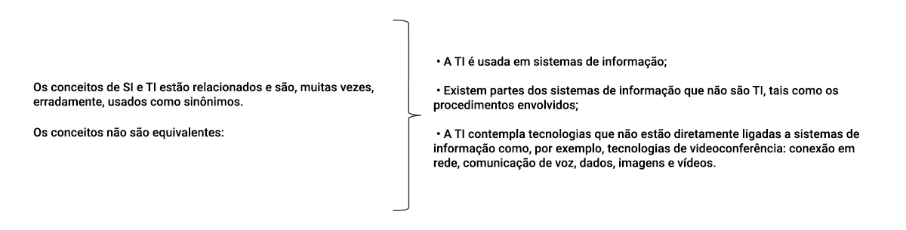
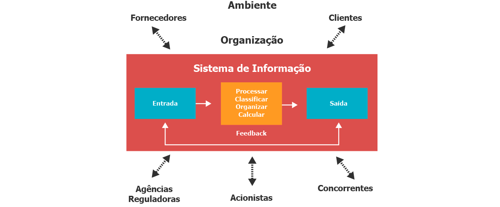
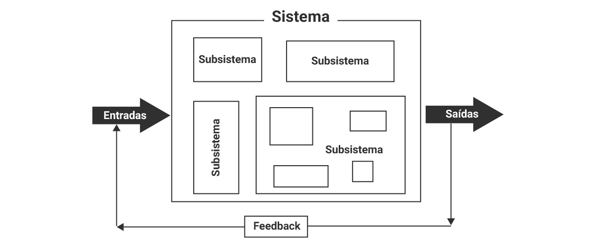

<<<<<<< HEAD
bbbbbb# Introdução
=======
# Introdução
>>>>>>> 35c5342497b374a69ba425619459b9b822e969dd

Nesta aula iremos fazer uma introdução à Teoria de Sistemas, e quais são as Classes de Sistema. Veremos ainda os princípios da Teoria de Sistemas.

----

## Conceituação de sistema

Cotidianamente convivemos com alguns sistemas. O sistema solar, por exemplo, vem sendo estudado e modificado desde os primórdios da humanidade. O Sistema solar pode ser considerado efetivamente um sistema? Claro que sim. Da mesma forma que o sistema de som de sua casa, que o sistema viário de sua cidade, que o sistema económico brasileiro e muitos outros que também o são.
  
## Como poderíamos definir, de forma geral, o conceito de sistema?

Para responder a essa pergunta, vamos tomar como exemplo o sistema de som que usamos em nossas casas para escutar nossos CDs, rádio e , eventualmente, conectar o tocador de MP3.

O conceito de sistema começa com a definição de suas partes:

Cada parte, além de executar sua tarefa (finalidade), deve fazê-lo de forma integrada e coordenada com as demais, garantindo o objetivo comum do sistema que, no caso, é reproduzir música.

Ao consultar o dicionário Aurélio, encontraremos a seguinte definição para sistema:

### Elementos básicos de um sistema

  **Outros exemplos de sistemas que podem ser citados são:controle de estoque, fluxo de caixa, construção civil, académico, planejamento e controle da produção**.

Todos esses sistemas são classificados como **sistemas de informação** cujo conceito veremos adiante.

São também exemplos: chuveiro elétrico, sistema de som, sistema de telefonia, sistema viário dentre outros. As partes que compõem um sistema e as relações entre eles determinam como o sistema funciona.

Seja qual for o sistema, podemos identificar, de forma genérica, os seguintes elementos constituintes:

> **Entrada**   São os insumos de que o sistema precisa para atingir o seus objetivo.

> **Processamentos**   É a execução dos procedimentos necessários ao bom funcionamento do sistema. Propicia a conversão da entrada bruta em forma mais útil e apropriada.

> **Saída**   É a apresentação do resultado ao ambiente externo gerado pelo sistema.

> **Realimentação** (ou feedback)   É a pate da saída do sistema que retorna ao próprio sistema com o objetivo de refinar ou corrigir os dados de entrada ou processamento.É parte da saída produzida pelo sistema que informa sobre seu comportamento.

> **Controle**   Refere-se ao monitoramento e avaliação do feedback, determinando se o sistema está atingindo o seu objetivo.

## Conceitos de sistemas de informação

No mundo globalizado de transformações rápidas, um tipo de sistema ganha relevância no contexto das organizações empresariais, transformando a forma e condução dos negócios. Hoje em dia, sai na frente aquele que detém a informação e a utiliza adequadamente. Dessa forma, os chamados Sistemas de Informação (SI) estão cada vez mais usados como meio de criar, armazenar, processar e transferir a informação no contexto das empresas.

Porém antes de estudarmos o conceito e definição do que vem a ser um Sistema de Informação, vamos definir o conceito de informação.

# O que é informação?

• É um dos recursos mais valiosos, importantes e valorizados em uma organização;

• Não podemos definir informação sem antes entender um conceito prévio: o dado;

• O conceito de informação é frequentemente confundido com o conceito de dado. Entretanto, os dois vocábulos são, além de distintos, complementares.

## Exemplo

Em um sistema de controle de ponto de funcionários de uma empresa, **o horário de entrada diário de cada funcionário é considerado dado**.

Combinando (processando) os horários de chegada de um funcionário em todos os dias de um mês, podemos obter o seu **percentual de atraso (% atraso)**, que é uma informação, possibilitando ao gerente penalizar ou parabenizar o funcionário.

Veja a demonstração na figura abaixo:

> Os horários de chegada do funcionário em cada dia são 9 fatos (dados) sobre os quais o gerente não pode tomar nenhuma decisão e servem de insumos (entrada) para o processamento da informação (SAÍDA = % de atraso mensal do funcionário).

Neste exemplo, para que se tenha a informação desejada, é necessário adicionar um novo dado (ENTRADA) ao contexto:

# Qual é o horário de entrada no trabalho?

Podemos concluir que: **A informação resulta do processamento (organização, arranjo e comparação) de dados afins**.

## Exemplo:

A tabela abaixo apresenta alguns exemplos de dados e respectivas informações derivadas.

------

# O que é um sistema de informação?

De uma forma simples e direta podemos definir sistema de informação como um sistema cuja finalidade é **prover informação** a alguém na medida certa.

A informação deve ser útil para quem a recebe, possibilitando a tomada de decisão dentro do contexto em que se aplica.

Vejamos algumas definições:

> **1**   è um conjunto de partes coordenadas que buscam prover a empresa com informações cujo objetivo é melhorar a tomada de decisões.

Os sistemas de informação podem ser:

> **2**   Conjunto organizado de pessoas, hardware, software, rede de comunicação e recursos de dados que coletam, transformam e disseminam informações em uma empresa (O' Brian, 2009)

> Fica evidente a limitação dos sistemas manuais no que se refere à capacidade do volume dado possível de processamento.
  > Na medida em que o volume de dados é grande, os sistemas tendem a ser automáticos produzindo informações mais precisas e de melhor qualidade, possibilitando às empresas uma administração mais eficiente.    A automação de tarefas rotineiras não só reduz os custos como também melhora o controle sobre as operações que, por sua vez, torna possível a melhoria no processo decisório com informações mais confiáveis.

## Tipos de sistemas de Informação

O papel do sistema de informação nas empresas torna-se cada dia mais relevante.
Podemos identificar três tipos de sistemas conforme o nível em que atuam nas organizações. são eles:
> Sistemas de Processamento de Transação
  Num primeiro momento, os sistemas automatizaram os processos rotineiros, os chamados **sistemas de processamento de transação (SPT)**, úteis não só na redução de custos mas também em um melhor controle e eficiência das operações de rotina. Os SPTs provêm informações de cunho operacional, ajudando no melhor controle das operações.

> Sistemas de Informação Gerencial
  A partir do momento que a operação funcionava de forma automatizada, os gestores perceberam que podiam expandir os sistemas para gerar informação mais complexa que pudesse apoiá-los nas decisões do dia a dia. Surgiam os **sistemas de informação gerencial (SIG)** para a gestão das atividades a que se destinavam. Os SIGs provêm informações gerenciais aos supervisores, gerentes e cargos correlatos, apoiando as decisões que se fazem necessárias no dia a dia.

> Sistema Estratégicos
  Não tardou muito para que o nível estratégico da empresa vislumbrasse que os sistemas podiam  proporcionar um diferencial competitivo em relação à concorrência. Era a geração dos **sistemas estratégicos (SIE)** que visam a atender à demanda da direção das empresas (diretores, vice-presidentes e presidentes), ajudando a traçar as diretrizes estratégicas da organização.

  ---

  ## Os Níveis da Organização e os Tipos de Sistema

  Mostram a atuação de cada tipo de sistema no seu respectivo nível organizacional:
  
  
  A tabela abaixo apresenta um quadro resumo dos tipos de sistemas de cada nível organizacional, relacionando a cada um tipo de informação que provê e quem faz uso dela: 

  

## Tecnologia de informação (TI)

  > Tecnologia da Informação (TI) pode ser entendida como o conjunto de recursos tecnológicos e computacionais para a geração e uso da informação, ou seja, o  conjunto de recursos não humanos que desempenha uma ou mais tarefas de processamento das informações do SI tal como coletar, transmitir, armazenar, recuperar, manipular e exibir dados. Em sistemas de informação, a tecnologia da informação é fundamental, pois é o meio utilizado para alcançar os fins desejados.

# Que TI estão presentes hoje nas empresas?

Podemos concluir que a tecnologia de informação (TI) é a infra-estrutura para os sistemas de informação (SI).

## Características básicas dos sistemas de informação

> Os sistemas estão inseridos em um contexto complexo

Já sabemos que os sistemas estão inseridos no contexto das organizações, conforme está ilustrado na figura abaixo. Isso significa dizer que, assim como as empresas, os sistemas sofrem influência do ambiente em que estão inseridos, representados por:

- Clientes.
- Fornecedores.
- Acionistas.
- Concorrentes.
- Agência reguladora, dentre outros

> Os sistemas são organizados em níveis hierárquicos

Os sistemas são constituídos hierarquicamente de outros sistemas denominados subsistemas.

**Por exemplo**: Um Sistema Financeiro pode ser formado pelos subsistemas recebimentos, pagamentos e fluxo de caixa.

Os subsistemas são partes de um sistema maior que podem ser formados por outros subsistemas (hierarquia de níveis).

O subsistema de recebimentos pode ser formado pelos subsistemas de contas a receber e contas recebidas, e cada um desses subsistemas, por sua vez, pode ser constituído de outros e assim sucessivamente.

## Teoria Geral dos Sistemas

A Teoria Geral dos Sistemas forneceu uma base para a unificação dos conhecimentos científicos e tecnológicos nas últimas décadas.

Ela tem por finalidade:

• Analisar a natureza dos sistemas e a relação entre suas partes;

• Identificar leis, propriedades e princípios característicos dos sistemas em geral.

A teoria de sistemas possui duas características relevantes. São elas:

